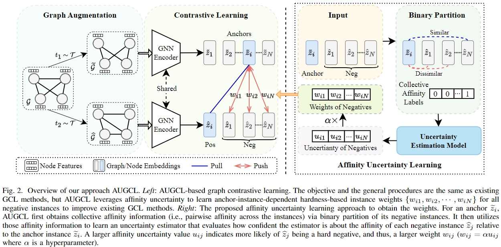

# Affinity Uncertainty-based Hard Negative Mining in Graph Contrastive Learning
Pytorch implementation for the paper "Affinity Uncertainty-based Hard Negative Mining in Graph Contrastive Learning"([Paper](https://arxiv.org/pdf/2301.13340.pdf)&[Appendix](https://github.com/mala-lab/AUGCL/blob/main/Appendix.pdf))".

## Absrtact
Hard negative mining has shown effective in enhancing self-supervised contrastive learning (CL) on diverse data types, including graph CL (GCL). The existing hardness-aware CL methods typically treat negative instances that are most similar to the anchor instance as hard negatives, which helps improve the CL performance, especially on image data. However, this approach often fails to identify the hard negatives but leads to many false negatives on graph data. This is mainly due to that the learned graph representations are not sufficiently discriminative due to oversmooth representations and/or non-independent and identically distributed (non-i.i.d.) issues in graph data. To tackle this problem, this article proposes a novel approach that builds a discriminative model on collective affinity information (i.e., two sets of pairwise affinities between the negative instances and the anchor instance) to mine hard negatives in GCL. In particular, the proposed approach evaluates how confident/uncertain the discriminative model is about the affinity of each negative instance to an anchor instance to determine its hardness weight relative to the anchor instance. This uncertainty information is then incorporated into the existing GCL loss functions via a weighting term to enhance their performance. The enhanced GCL is theoretically grounded that the resulting GCL loss is equivalent to a triplet loss with an adaptive margin being exponentially proportional to the learned uncertainty of each negative instance. Extensive experiments on ten graph datasets show that our approach does the following: 1) consistently enhances different state-of-the-art (SOTA) GCL methods in both graph and node classification tasks and 2) significantly improves their robustness against adversarial attacks.



## Training & Evaluation
Taking the dataset MUTAG as an example, run the following command to obtain the experimental results:
    
    python main.py --DS $dataset --lr 0.01 --num-gc-layers 3 --aug random2


## Citation
```bibtex
@inproceedings{niu2024augcl,
  title={Affinity Uncertainty-based Hard Negative Mining in Graph Contrastive Learning},
  author={Niu, Chaoxi and Pang, Guansong and Chen, Ling},
  year={2024},
}
```

## Acknowledgements
The implementation of this code is largely built upon [GraphCL](https://github.com/Shen-Lab/GraphCL/tree/master/unsupervised_TU#acknowledgements)
